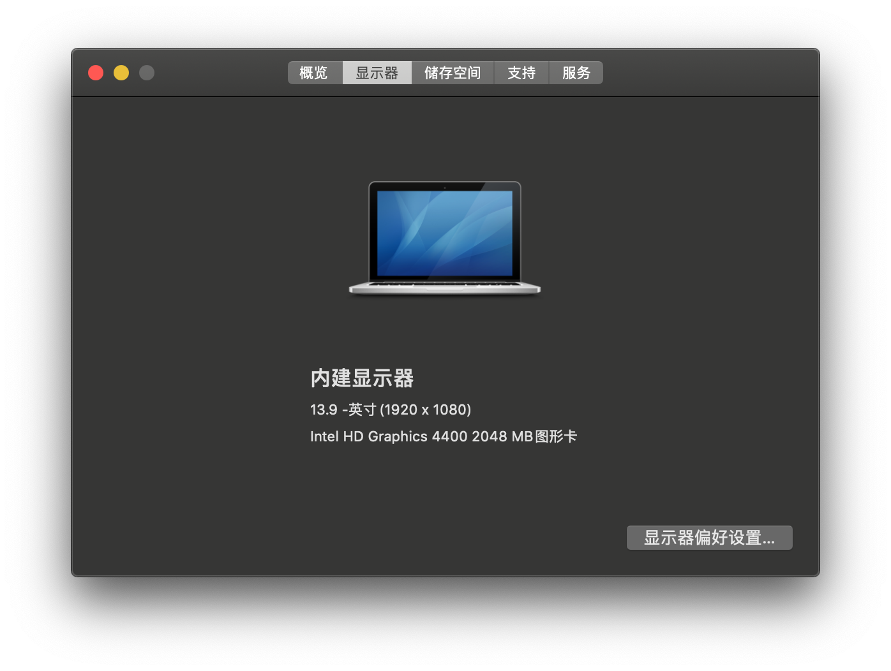
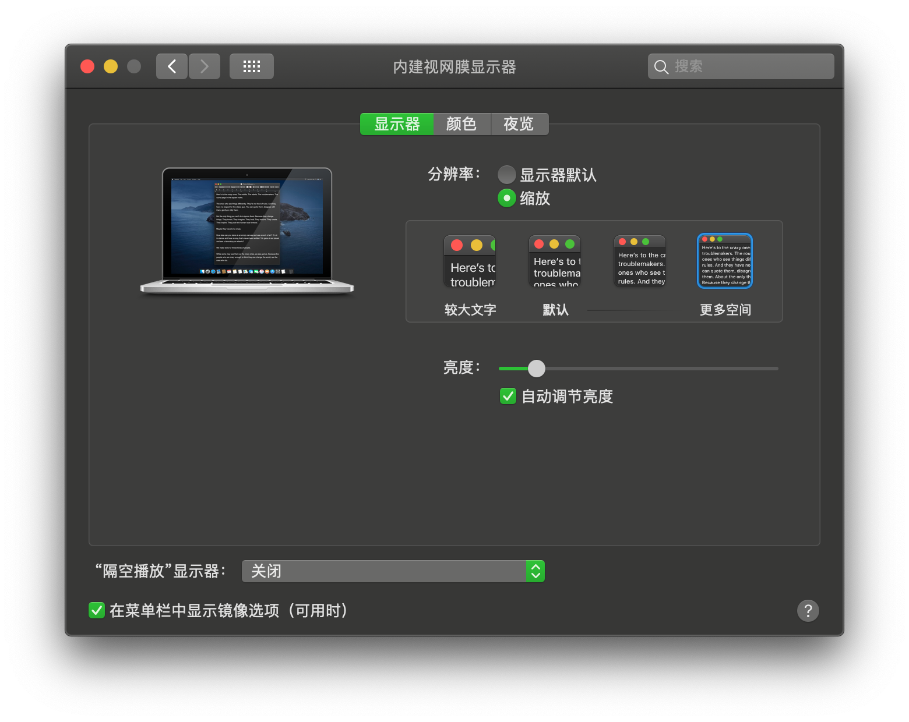

联想小新笔记本V1000 FHD黑苹果HotPatch EFI
# Lenovo-V1000-FHD黑苹果EFI

# 适配10.15.4

## 电脑配置

| 规格     | 详细信息                                                     |
| -------- | ------------------------------------------------------------ |
| 电脑型号 | 联想小新笔记本V1000 FHD                                      |
| 操作系统 | macOS Catalina 10.15.4                                       |
| 处理器   | 智能英特尔®酷睿 Haswell 双核处理器i7-4510U                   |
| 内存     | Ramaxel Technology 4 GB 1600MHz DDR3L + Kingston 8GB 1600MHz DDR3L |
| 硬盘     | 闪迪SDSSDA-120G                                              |
| 显卡     | Intel HD Graphics 4400 2048 MB 图形卡                        |
| 显示器   | FHD 1920x1080 (14 英寸)                                      |

## 系统截图

| 已解决                                                       |
| ------------------------------------------------------------ |
| 屏蔽独显                                                     |
| 电池电量显示（单独的补丁见other文件夹）                      |
| 显存修改为2048MB（使用FB-VRAM Patcher.app生成clover kext补丁 ） |
| 亮度调节、亮度保存（hotpatch）                               |
| 有线网卡（使用RealtekRTL8111.kext）                          |
| 声卡（使用VoodooHDA.kext）                                   |
| 自带键盘（使用VoodooPS2Controller.kext）                     |
| 蓝牙固件加载                                                 |

| 已知问题          |
| ------------------------- |
| 自带intel无线网卡无法驱动，换无线网卡可解决 |
| hdmi、vga外接显示器未测试 |

| 相关链接                                                     |
| ------------------------------------------------------------ |
| hotpatch（https://github.com/RehabMan/OS-X-Clover-Laptop-Config） |
| 修改显存2048MB（http://bbs.pcbeta.com/viewthread-1784050-1-1.html） |
| clover（https://sourceforge.net/projects/cloverefiboot）     |

