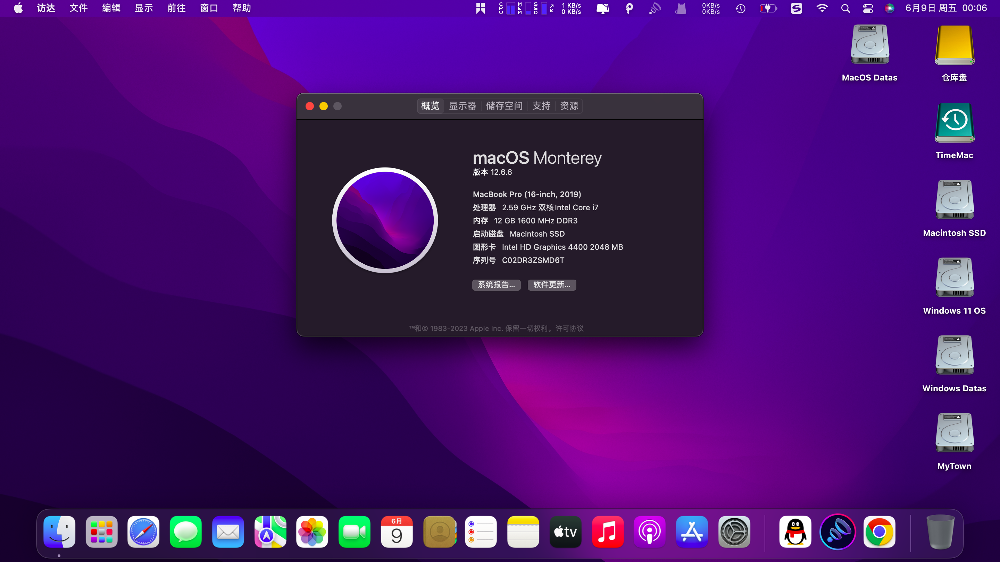

联想小新笔记本V1000 FHD黑苹果HotPatch OpenCore 0.6.0 EFI
# Lenovo-V1000-FHD黑苹果 OpenCore 0.6.0 EFI

# 适配 macOS Big Sur Beta 3 (20A5323l)

## 电脑配置

| 规格     | 详细信息                                                     |
| -------- | ------------------------------------------------------------ |
| 电脑型号 | [联想小新笔记本V1000 FHD](https://item.lenovo.com.cn/product/32518.html) |
| 操作系统 | macOS Big Sur Beta 3 (20A5323l)                              |
| 处理器   | [英特尔®酷睿 i7-4510U](https://ark.intel.com/content/www/cn/zh/ark/products/81015/intel-core-i7-4510u-processor-4m-cache-up-to-3-10-ghz.html) |
| 内存     | Ramaxel Technology 4 GB 1600MHz DDR3L + Kingston 8GB 1600MHz DDR3L |
| 硬盘     | 闪迪SDSSDA-120G + 希捷500G                                   |
| 显卡     | Intel HD Graphics 4400 2048 MB 图形卡                        |
| 显示器   | FHD 1920x1080 (14 英寸)                                      |

## 系统截图

| 已解决                                                       |
| ------------------------------------------------------------ |
| 屏蔽独显                                                     |
| 电池电量显示（单独的补丁见other文件夹）                      |
| 显存修改为2048MB（Hackintool生成hd4400缓冲帧补丁）           |
| 亮度调节、亮度保存（hotpatch）                               |
| 有线网卡（使用RealtekRTL8111.kext）                          |
| 声卡（使用VoodooHDA.kext）                                   |
| 自带键盘、触摸板（使用VoodooPS2Controller.kext）             |
| 蓝牙（使用IntelBluetoothFirmware.kext、IntelBluetoothInjector.kext） |

| 已知问题          |
| ------------------------- |
| 自带intel无线网卡（后续添加） |
| hdmi、vga外接显示器未测试（可能没有音频输出） |

| 其他问题        |
| ------------------------- |
| 安装或启动时重复输出IOUSBHostDevice相关日志（去掉多余Kext驱动发现实际卡在forcing cs_runtime for entitlement:com.apple.rootless.restricted-block-devices、等待大约20-30分钟即可） |
| 安装完成后OpenCore启动项多出一个preboot 就是Big Sur系统盘 |
| 不能通过OpenCore引导windows系统 |

| 相关链接                                                     |
| ------------------------------------------------------------ |
| [Apple](https://www.apple.com)                               |
| [Hotpatch](https://github.com/RehabMan/OS-X-Clover-Laptop-Config) |
| [OpenCore](https://github.com/acidanthera/OpenCorePkg)       |

