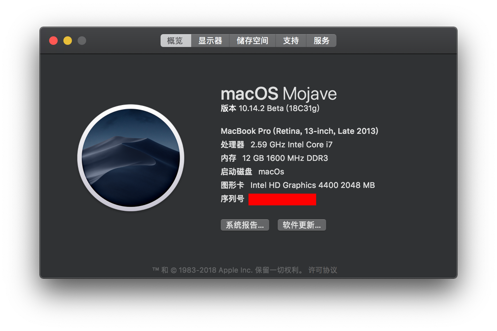
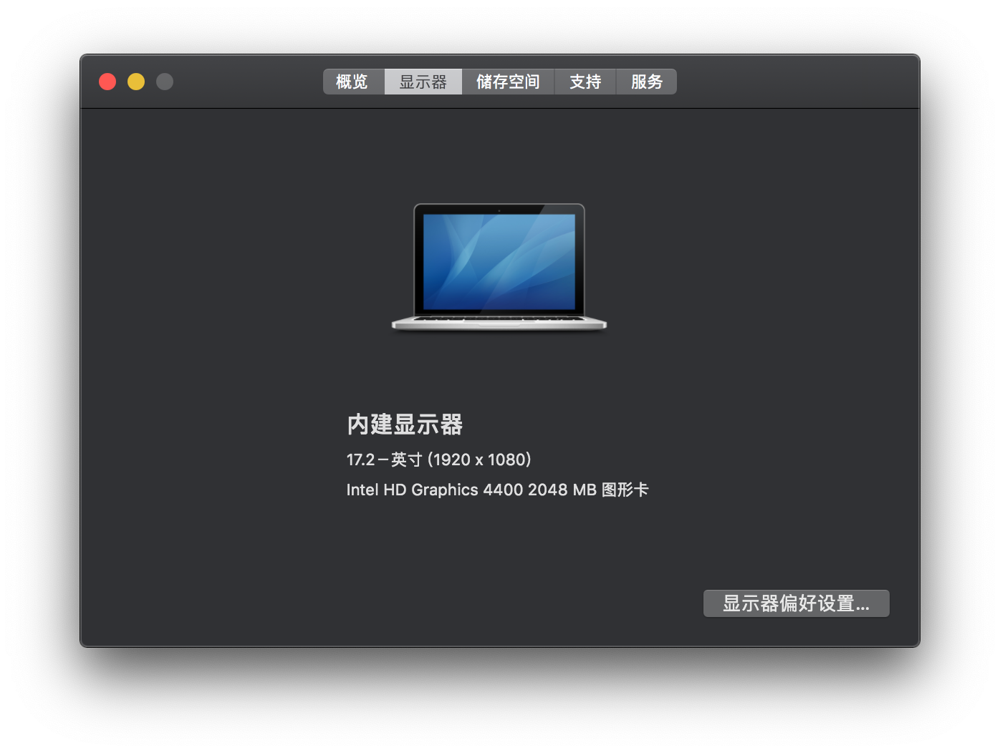
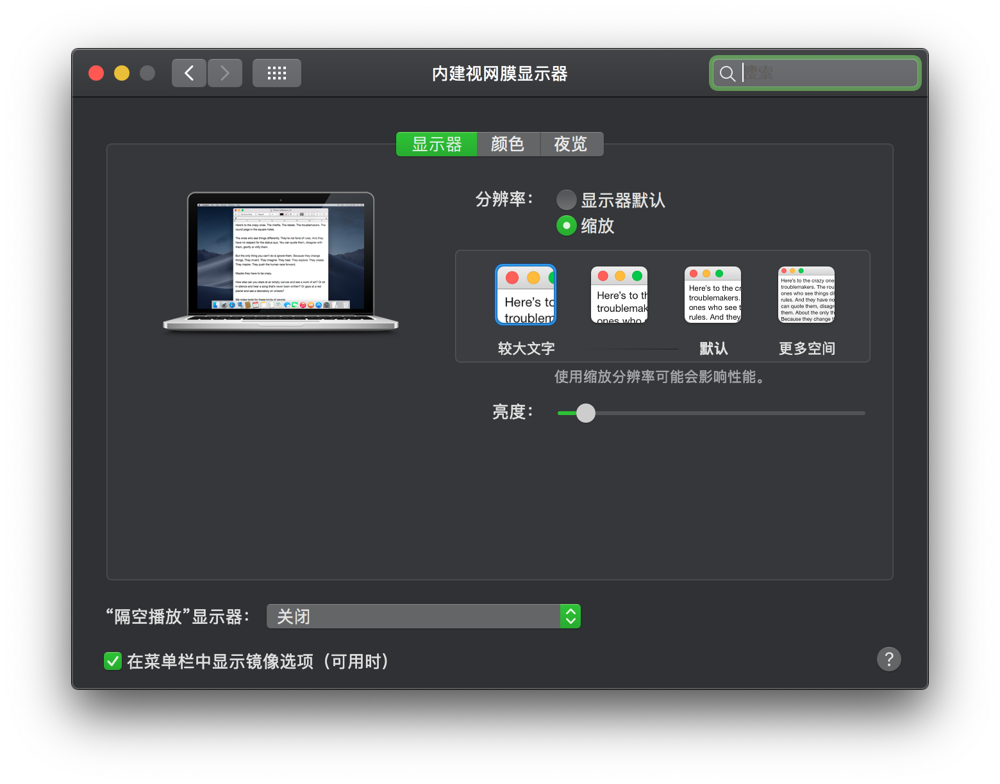

联想小新笔记本V1000 FHD黑苹果EFI
# Lenovo-V1000-FHD黑苹果EFI

# 适配10.14.5

## 电脑配置

| 规格     | 详细信息                                                     |
| -------- | ------------------------------------------------------------ |
| 电脑型号 | 联想小新笔记本V1000 FHD                                      |
| 操作系统 | macOS Mojave 10.14.5                                         |
| 处理器   | 智能英特尔®酷睿 Haswell 双核处理器i7-4510U                   |
| 内存     | Ramaxel Technology 4 GB 1600MHz DDR3L + Kingston 8GB 1600MHz DDR3L |
| 硬盘     | 闪迪SDSSDA-120G                                              |
| 显卡     | Intel HD Graphics 4400 2048 MB 图形卡                        |
| 显示器   | FHD 1920x1080 (14 英寸)                                      |

## 系统截图

